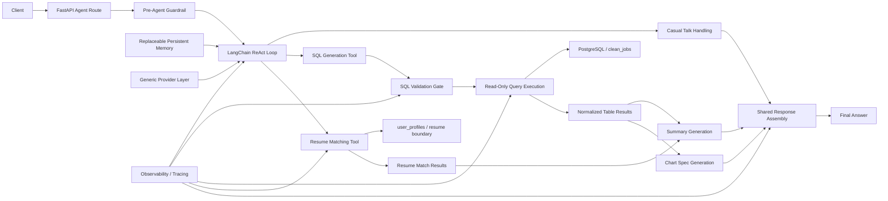
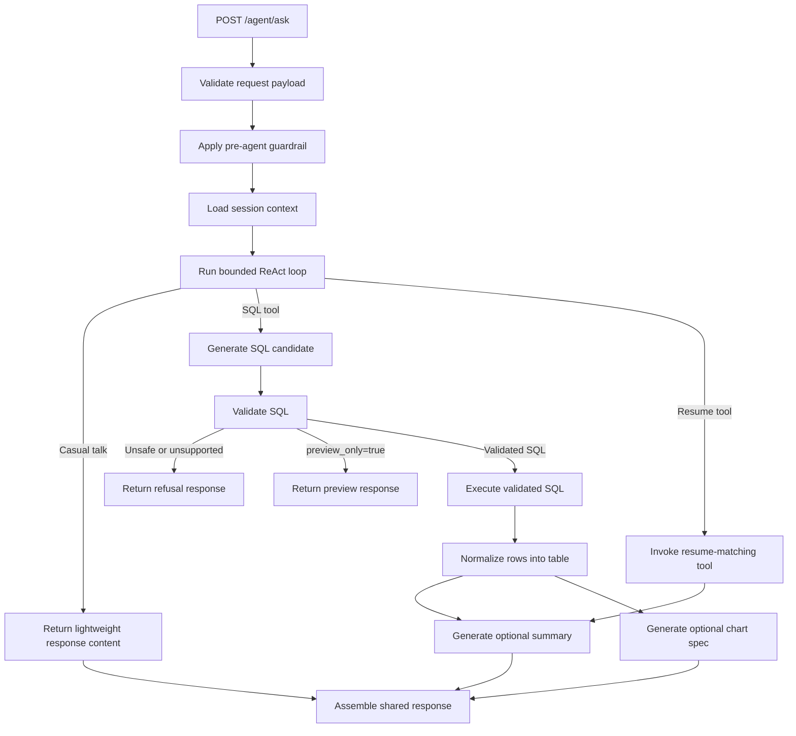

# Database Agent Architecture

This document defines the planned runtime architecture for the database-agent layer.

## Status

- A thin `POST /agent/ask` route and stub service seam exist in code today.
- No full runtime design in this file should be assumed to exist yet beyond that scaffold.
- Existing crawler, ETL, search, resume matching, and schema components are out of scope for modification in this phase unless explicitly expanded later.

## Current Implemented Slice

The current repository includes only the earliest agent scaffold:

- `src/internhunter/api/routes/agent_routes.py` wires `POST /agent/ask`
- `src/internhunter/api/schemas/agent.py` defines the typed HTTP contract baseline
- `src/agents/service.py` returns stub `ok` and preview envelopes only

The current code does not yet implement the full runtime described below:

- no pre-agent guardrails
- no real tool routing
- no SQL generation or validation
- no SQL execution
- no summary or chart generation
- no persistent memory behavior
- no resume-tool invocation behind `/agent/ask`

## Purpose

- Describe how the database-agent MVP fits into the current backend without redesigning the existing system.
- Define the main runtime components, boundaries, and request flow for the future agent layer.
- Provide an implementation map that stays aligned with `docs/agent/vision.md`, `docs/agent/sql_contract.md`, `docs/agent/api_contract.md`, and `docs/agent/data_dictionary.md`.
- Keep architecture decisions narrow, explicit, and isolated from frozen ETL/crawler areas.

## Scope And Non-Goals

This document covers the planned runtime architecture for:

- the public MVP agent endpoint
- pre-agent guardrail handling
- agent orchestration flow
- bounded ReAct-style tool-routing behavior
- SQL generation, validation, and read-only execution
- resume-matching tool invocation
- result shaping
- summary generation
- chart-spec generation
- refusal and error shaping seams
- session-level follow-up context
- observability hooks

This document does not define:

- the exact public wire format in full detail
- the detailed SQL whitelist or validator policy tables
- the detailed security threat model
- ETL or crawler redesign
- database schema changes
- expanded table access beyond `clean_jobs`
- raw SQL public access
- frontend dashboard design

## Architecture Goals

The database-agent MVP architecture should satisfy both product and engineering goals.

### Product Goals

- Let users ask English questions about the job database.
- Let users ask for resume-matching help through the same agent entrypoint when `user_id` is provided.
- Show generated SQL to the user for SQL-capable requests.
- Return read-only results as tables.
- Return short natural-language summaries.
- Return optional chart specs for chartable questions.
- Support simple follow-up questions within a session.
- Support light small-talk behavior without turning the product into a broad assistant.
- Refuse unsafe or unsupported database operations.

### Engineering Goals

- Keep SQL generation and execution narrow, testable, and safe.
- Keep tool routing explicit, bounded, and easy to reason about.
- Keep the first ReAct loop capped at 2-3 tool steps.
- Ensure only validated SQL can execute.
- Keep `clean_jobs` as the only product-facing query table in MVP.
- Preserve clear module boundaries between HTTP, orchestration, SQL policy, execution, and formatting.
- Add new isolated modules rather than modifying stable ETL/crawler code.
- Keep implementation choices replaceable where possible, especially for memory and provider internals.

## MVP Constraints

The runtime architecture must respect the existing project constraints:

- Query scope is `clean_jobs` only.
- `raw_jobs` is not product-facing and is not agent-queryable in MVP.
- No write SQL, schema changes, admin SQL, or unrestricted database access.
- No ETL/crawler redesign and no processor-contract changes.
- No assumptions that unfinished planning docs already represent implemented behavior.
- No public split endpoints for preview, charting, explanation, or resume matching in MVP.
- No public raw SQL mode.
- No separate visible intent-router subsystem in the first architecture.

The SQL shape remains intentionally narrow and is governed by `docs/agent/sql_contract.md`.

## Relationship To Other Agent Docs

This document owns the runtime shape of the agent layer.

It should work with, but not replace, the other agent docs:

- `docs/agent/api_contract.md` defines the public endpoint contract and response behavior.
- `docs/agent/sql_contract.md` defines allowed SQL, blocked SQL, validation behavior, and whitelist rules.
- `docs/agent/security_model.md` defines the broader safety model, threat model, and audit/security policy.
- `docs/agent/data_dictionary.md` defines how the agent should interpret `clean_jobs` fields.
- `docs/agent/eval_set.md` defines evaluation and regression cases for the architecture described here.

## System Context

InternHunter is currently a modular monolith with public endpoints under `src/internhunter/api/`, storage under `src/internhunter/storage/`, search logic under `src/internhunter/search/`, resume matching under `src/internhunter/resume/`, and LLM provider infrastructure under `src/internhunter/llm/`.

The current FastAPI app mounts a single demo router and exposes health, search, and resume-matching routes. Those existing flows remain intact during the database-agent phase.

The database-agent layer should be added as a new application subsystem that:

- plugs into the existing FastAPI app through a new route module
- reuses the current database session infrastructure
- uses a LangChain-native provider path for agent generation/orchestration
- depends on the existing `clean_jobs` ORM model and schema
- may call the existing resume-matching capability through a bounded internal tool seam
- does not change crawler, ETL, or stable search/resume APIs

At a high level, the future runtime sits between the public API route and the available bounded tools:

## Proposed Runtime Boundaries

The MVP architecture should use one orchestrated runtime flow behind one public endpoint.

Recommended boundary split:

- **API layer**
  - accepts HTTP requests
  - validates request payload shape
  - invokes the agent service
  - maps internal outcomes to the API contract

- **Pre-agent guardrail layer**
  - performs lightweight request screening and bounded request shaping
  - rejects obviously unsupported or malformed requests early when appropriate
  - does not replace SQL validation or become a full policy engine

- **Agent orchestration layer**
  - coordinates the full ask flow
  - loads session context
  - performs bounded ReAct-style tool routing
  - calls SQL generation or other approved tools
  - handles preview and refusal branches
  - coordinates summary and chart generation

- **Query service layer**
  - validates generated SQL against policy
  - executes validated SQL in read-only mode
  - normalizes execution results into tabular output

- **Resume tool adapter layer**
  - invokes the existing resume-matching capability
  - enforces `user_id` requirements for resume-scoped requests
  - normalizes resume-match results into the shared response envelope

- **Storage layer**
  - provides DB sessions and ORM models
  - does not own text-to-SQL behavior

- **LangChain-native model layer**
  - provides model access for the database agent through a LangChain-native path
  - does not own agent orchestration or SQL execution policy

This keeps the route thin, the validator isolated, and the execution path independent from ETL logic.

## Module Layout

The architecture should recommend isolated new modules rather than broad changes to existing packages.

Recommended module direction:

- `src/internhunter/api/routes/agent.py`
  - agent HTTP route
  - request parsing
  - response mapping

- `src/agents/`
  - orchestration-level components
  - prompt/context preparation
  - session context handling
  - tool routing
  - summary and chart coordination
  - refusal and response composition helpers

- `src/services/query/`
  - SQL validation
  - SQL execution
  - result-table normalization
  - schema/context helpers specific to queryability

Suggested responsibility split inside those new areas:

- `src/agents/service.py`
  - main ask-flow coordinator

- `src/agents/context.py`
  - schema dictionary and session-context assembly

- `src/agents/memory.py`
  - session-level memory boundary

- `src/agents/react_loop.py`
  - bounded LangChain ReAct wrapper

- `src/agents/tools.py`
  - bounded tool registry / tool selection helpers

- `src/agents/summary.py`
  - short answer generation from question plus result context

- `src/agents/charting.py`
  - chart suitability checks and chart-spec generation

- `src/services/query/sql_validator.py`
  - SQL validation and minimal normalization

- `src/services/query/executor.py`
  - validated read-only SQL execution

- `src/services/query/table_formatter.py`
  - raw row normalization to a standard table artifact

- `src/agents/resume_tool.py`
  - adapter around the existing resume-matching capability

The exact filenames may change later, but the boundary split should remain.

## Components And Responsibilities

### 1. Agent Request Handler

Consumes:

- API request DTO

Produces:

- internal ask request for orchestration

Must not:

- generate SQL directly
- execute SQL directly
- contain SQL policy rules

### 2. Pre-Agent Guardrail

Consumes:

- request payload
- request metadata

Produces:

- bounded request context for orchestration
- early refusal when the request is obviously unsupported or malformed

Must not:

- replace downstream SQL validation
- become a separate public routing subsystem
- widen tool access

### 3. Session Context Loader

Consumes:

- `session_id`
- current question

Produces:

- prior-turn context snapshot for follow-up handling

Must not:

- become an auth or identity system
- become tightly coupled to a single memory vendor or backend

MVP identity boundary:

- `session_id` is a conversation-scoped context key for agent follow-ups
- `session_id` is not an authenticated user identifier
- existing resume-matching `user_id` remains a separate concern under `user_profiles`
- the SQL/query path should not require `user_id`
- `user_id` may be required by user-scoped tools such as resume matching, but it must not change SQL table scope or SQL permissions in MVP

### 4. ReAct Tool Router

Consumes:

- user question
- session context
- optional `user_id`

Produces:

- selected tool path
- tool-specific routing metadata
- unsupported-intent refusal signal when no MVP tool applies

Must not:

- widen schema access silently
- bypass downstream SQL validation for SQL-capable routes
- exceed the bounded 2-3 step tool-loop budget

### 5. SQL Generation Component

Consumes:

- user question
- session context
- schema/context payload

Produces:

- SQL candidate or unsupported-intent refusal signal

Must not:

- execute SQL
- bypass the validator

### 6. SQL Validation Layer

Consumes:

- model-generated SQL candidate

Produces:

- validated SQL
- normalization metadata
- refusal category if invalid or unsafe

Must not:

- broadly rewrite invalid SQL to force success
- execute SQL

### 7. Read-Only Query Executor

Consumes:

- validated SQL only

Produces:

- raw query result rows

Must not:

- accept raw unvalidated SQL
- mutate the database

### 8. Table Result Formatter

Consumes:

- raw execution rows

Produces:

- normalized table artifact with columns, rows, and row count

Must not:

- change query semantics

### 9. Resume-Matching Tool Adapter

Consumes:

- user question
- `user_id`

Produces:

- normalized resume-match result artifact

Must not:

- expose raw `user_profiles` browsing
- widen SQL table scope
- become a second public endpoint

### 10. Summary Generator

Consumes:

- question
- table artifact or resume-match artifact
- optional session context

Produces:

- short user-facing summary

Must not:

- invent facts unsupported by the result
- operate as a replacement for SQL execution

### 11. Chart Spec Generator

Consumes:

- question
- chart hint
- normalized table artifact

Produces:

- Vega-Lite-compatible chart spec or chart omission warning

Must not:

- render images
- create charts for unsafe, preview-only, or non-executed SQL results
- create a second execution path

### 12. Refusal / Error Mapper

Consumes:

- validation outcomes
- unsupported-intent outcomes
- execution or formatting failures

Produces:

- internal refusal/error classification ready for API response shaping

Must not:

- expose raw stack traces or secrets

### 13. Observability Hooks

Consumes:

- request lifecycle events
- validation outcomes
- execution outcomes

Produces:

- structured logs
- request trace identifiers
- generic tracing spans/events for tools such as Langfuse or MLflow

Must not:

- define the full security policy alone
- become a hard dependency on one observability vendor

## Request Flow

The MVP runtime should follow this end-to-end sequence:

Step-by-step:

1. API route validates request shape.
2. Pre-agent guardrail performs lightweight screening and bounded request shaping.
3. Agent service loads prior session context when `session_id` is provided.
4. A bounded ReAct/tool-routing step selects the SQL/query path, casual-talk path, resume-matching path, or refusal path.
5. For SQL-capable requests, the context builder assembles only the approved schema and field guidance needed for MVP.
6. SQL generation attempts to answer the question.
7. SQL validator checks the candidate against the SQL contract.
8. If SQL validation fails, the system returns a refusal and stops.
9. If `preview_only=true`, the system returns preview output and stops before execution.
10. If SQL validation succeeds and execution is allowed, the executor runs only the validated SQL.
11. Raw rows are normalized into the table shape expected by the API contract.
12. For resume-matching requests, the orchestration layer invokes the bounded resume tool and normalizes its output.
13. Summary generation runs when requested or enabled by default.
14. Chart generation runs only from executed SQL/table results when explicitly requested or when chart intent is inferred and the result is suitable.
15. The orchestration layer returns a final structured outcome for API response shaping.

## Data Flow

The architecture should treat the main artifacts of the runtime as explicit internal objects even if the exact classes are not implemented yet.

Recommended artifact sequence:

1. **Ask request**
   - question
   - preview flag
   - chart options
   - summary flag
   - debug flag
   - session identifier
   - optional user identifier used by user-scoped tools such as resume matching

2. **Guardrailed request context**
   - safe request metadata
   - request mode flags
   - early refusal indicator when applicable

3. **Session context**
   - prior user turns or reduced context summary
   - previous result reference if applicable
   - no assumption that the session maps to a durable user identity

4. **Tool selection**
   - chosen tool path
   - tool-specific routing metadata

5. **SQL candidate**
   - model-generated SQL before validation

6. **Validation result**
   - accepted or refused
   - validated SQL
   - normalization metadata such as default limit insertion
   - refusal code/category when blocked

7. **Execution result**
   - raw database rows for validated SQL

8. **Table artifact**
   - columns
   - normalized rows
   - row count

9. **Resume-match artifact**
   - normalized match rows
   - match metadata

10. **Summary artifact**
   - short natural-language explanation

11. **Chart artifact**
   - chart type
   - Vega-Lite-compatible chart spec
   - warning if omitted

12. **Final response artifact**
   - status
   - SQL visibility fields
   - table
   - summary
   - chart
   - warnings
   - metadata
   - error information

The architecture should keep these artifacts explicit so each stage is unit-testable and replaceable.

## Trust And Safety Boundaries

The database-agent MVP is safety-sensitive because it turns natural language into executable SQL and user-scoped tool calls. The architecture must make trust boundaries explicit.

Recommended ownership split:

- **Pre-agent request screening**
  - owned by the pre-agent guardrail layer
  - keeps obviously unsupported requests from entering the full loop unchanged

- **Prompt/context constraints**
  - owned by the orchestration/context-building layer
  - ensures the model sees only the approved schema and scope

- **SQL whitelist and blocked-shape rules**
  - owned by the validator policy layer
  - governed by `docs/agent/sql_contract.md`

- **Table and column scope enforcement**
  - owned by the validator policy layer
  - must block anything outside the MVP whitelist

- **Read-only execution guarantee**
  - owned by the executor boundary
  - executor consumes validated SQL only

- **User-facing refusal and error shaping**
  - owned by orchestration and API mapping layers
  - low-level validator codes may be translated into safer user-facing messages

- **Threat model and broader security policy**
  - owned by `docs/agent/security_model.md`

The architecture should explicitly state that unsafe SQL must never reach execution.

## Integration Points With Existing Codebase

The future agent layer should reuse the existing backend seams where possible.

### Existing Modules To Reuse

- `src/internhunter/api/app.py`
  - current FastAPI app entrypoint

- `src/internhunter/api/routes/`
  - existing route layout pattern

- `src/internhunter/storage/session.py`
  - database session management

- `src/internhunter/storage/models.py`
  - existing ORM models, especially `CleanJobDB`

- `src/internhunter/resume/repository.py`
  - current `user_profiles` ownership boundary for resume-specific `user_id`

- `src/internhunter/llm/`
  - existing LLM/provider infrastructure that may still supply lower-level model access or shared configuration around the LangChain-native agent path

- `src/internhunter/common/logging.py`
  - structured logging path

### Existing Areas To Leave Untouched

- crawler extraction logic
- TopCV selectors
- ETL orchestration
- processor contract
- existing search API
- existing resume matching API
- `raw_jobs` / `clean_jobs` schema

### Existing Boundaries To Respect

- API should translate HTTP to service calls, not own SQL policy.
- Storage should own DB sessions and models, not agent orchestration.
- LangChain-native model access should supply model invocation, not database rules.
- The agent layer should not depend on raw crawl artifacts or ETL-stage evidence structures.
- The agent layer should not repurpose resume-matching `user_id` as a SQL scope or permission control.
- SQL/query handling should ignore `user_id`.
- Resume-matching tool handling may require `user_id` and should fail safely when it is absent.

## Data Contracts And Internal Artifacts

The architecture doc should anticipate internal typed objects without redefining the full public API contract.

Expected internal objects include:

- ask-request object
- guardrailed-request object
- session-context object
- tool-selection object
- SQL-candidate object
- validation-result object
- table-result object
- summary-result object
- chart-result object
- final response assembly object

Ownership boundaries:

- public HTTP request and response shapes belong to `docs/agent/api_contract.md`
- SQL rules and validation outcomes belong to `docs/agent/sql_contract.md`
- field semantics belong to `docs/agent/data_dictionary.md`

The architecture should describe where these objects appear in the runtime flow and why they matter for testing and isolation.

## Tech Stack And Dependency Notes

The architecture should reuse the project's current stack where it already fits the MVP:

- FastAPI for HTTP entrypoints
- Pydantic for request/response and internal typed objects
- SQLAlchemy sessions for database access
- existing PostgreSQL-backed `clean_jobs` storage
- existing LLM/provider infrastructure where useful for shared configuration and lower-level model access
- structured logging through the current logging stack

Planned internal orchestration direction:

- The database agent should use a LangChain-native provider path for a bounded ReAct/tool-routing flow.
- LangChain should remain an internal implementation detail behind the single public endpoint.
- The first MVP should use a single provider configuration and defer fallback-provider logic until later hardening.

Dependency notes:

- no SQL parsing or SQL AST validation dependency is currently documented in the project dependencies
- no chart-rendering dependency is required because MVP returns chart specs only
- Vega-Lite compatibility is a response-contract requirement, not a rendering requirement

The architecture may name likely dependency categories later, but should avoid overcommitting to a specific SQL validation library until that decision is made.

## Observability And Operational Notes

The architecture should include lightweight observability guidance for the MVP flow.

Recommended log or trace points:

- request received
- pre-agent guardrail passed or refused
- session context used or absent
- tool selected or refusal path selected
- SQL generated
- SQL validation accepted or refused
- preview skipped execution
- execution started and completed
- resume-matching tool invoked or skipped
- result row count
- summary/chart generation attempted or skipped
- final response status

Operational constraints to note:

- the MVP is a synchronous request/response flow
- SQL result size is controlled primarily through validator-enforced limits
- likely latency contributors are SQL generation, query execution, summary generation, and chart generation
- caching is not required for MVP
- rate limiting is deferred
- the first implementation should use these timeout budgets:
  - tool routing and SQL generation: 20 seconds
  - SQL validation: 1 second
  - SQL execution: 5 seconds
  - summary generation: 10 seconds
  - chart generation: 5 seconds
  - target end-to-end request budget: 30 seconds

Observability should remain generic at the architecture level. Tools such as Langfuse or MLflow may be used as examples of tracing and evaluation plumbing, but they are not hard architectural dependencies of the MVP contract.

The detailed retention or privacy policy for logs belongs in the security model rather than this architecture doc.

## Testing Implications

This architecture implies several clean test seams.

### Unit-Level Seams

- pre-agent guardrail behavior
- session context assembly
- tool routing behavior
- SQL validation behavior
- table formatting
- resume-tool adapter behavior
- refusal mapping
- summary eligibility and shaping
- chart suitability and chart-spec generation

### Integration-Level Seams

- end-to-end ask flow from request to response
- validated SQL execution path
- preview-only branch
- refusal branch
- chart-included branch
- resume-matching branch
- same-session follow-up behavior
- light small-talk branch

### Contract-Level Seams

- response assembly consistent with `api_contract.md`
- safety outcomes consistent with `sql_contract.md`
- result-field meanings consistent with `data_dictionary.md`

The architecture should encourage component boundaries that make these tests straightforward.

## Future Expansion Boundaries

The architecture should explicitly mark the following as future work, not MVP runtime requirements:

- additional tables beyond `clean_jobs`
- broader SQL query shapes beyond the MVP SQL contract
- public semantic search endpoint behavior
- richer charting and dashboard workflows
- authenticated user identity
- stronger audit policy and rate limiting
- multi-agent behavior
- broader analytics over long-form text fields
- provider fallback or provider specialization

Future additions should extend the isolated agent/query layers rather than pushing new logic into crawler or ETL modules.

## Deferred Decisions

The following decisions are still open and should be documented explicitly rather than assumed silently:

- what concrete persistent backend session memory uses in MVP behind a replaceable seam
- whether a dedicated SQL parsing/AST library will be added
- what concrete LangChain-native model configuration should be used first after research and A/B testing
- whether summary generation needs more LLM involvement beyond the deterministic-first or hybrid MVP stance

Already resolved for the current MVP planning baseline:

- keep `session_id` separate from authenticated identity and user-scoped `user_id`
- allow `user_id` in the agent contract for resume-matching tool use without changing SQL table scope
- keep resume-matching `user_id` handling separate from agent session context and SQL permissions
- do not introduce a separate visible intent router in the first architecture
- keep the first ReAct loop bounded and capped at 2-3 tool steps
- keep chart generation result-driven from executed SQL/table results, while allowing chart intent inference only for routing and chart-request handling
- emit a trace identifier on every request
- use the initial MVP timeout budgets documented in the security and API-layer contracts
- use a generic provider layer with a single provider configuration first, while deferring fallback-provider logic

These decisions do not block the architecture from defining the main runtime boundaries, but they should remain visible.
